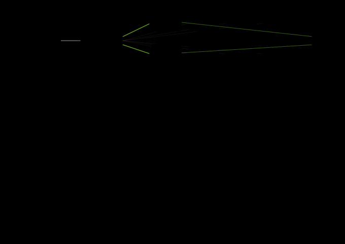
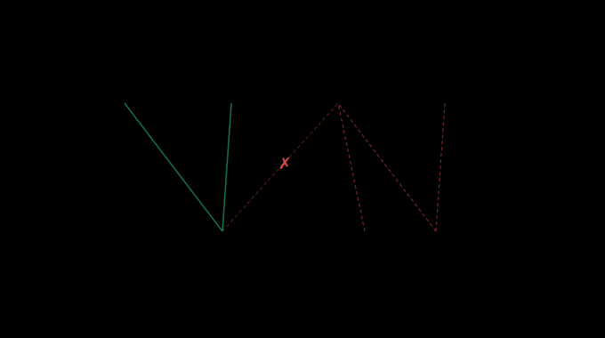

# SRN: Selective Routing Network

## TL;DR — What We Found

**SRN is a real architecture that matches Transformer quality, but Flash Attention killed the efficiency story.**

| Finding | Details |
|---------|---------|
| **Quality: Hybrid matches Transformer** | Hybrid SRN (3 attention + 9 routing layers) reached val_loss 3.753 vs Transformer's 3.755 on FineWeb-Edu. Perplexity 43 vs 43. |
| **But needs 2x training steps** | Transformer hit 3.755 at 5K steps. Hybrid needed 10K steps to reach 3.753. At equal steps (5K), hybrid was at 3.953. |
| **SRN uses MORE VRAM, not less** | At 8K context: Hybrid 28.3GB vs Transformer 10.7GB. The expert routing layers create massive activation tensors at long context. |
| **Flash Attention solved the Transformer's scaling problem** | Transformer handles 16K context at 20.4GB VRAM. Both models OOM at 32K. The "SRN scales better" narrative doesn't hold. |
| **The routing is efficient, the experts are not** | The DynamicSparseRouter is O(N×96) — already linear. But the GEM expert layers create (B, N, 8, 384) activation tensors that blow up at long context. |
| **SRN is a legitimate research result** | It matches Transformer quality with a novel architecture. That's genuinely impressive. But matching isn't enough to dethrone the incumbent. |

**Bottom line:** SRN is a cool architecture that works. It's not a lie. But it's not a win either. Flash Attention + years of engineering investment made Transformers too good to beat with a routing-based alternative.

---

A neural network architecture that replaces Transformer self-attention with dynamic sparse routing to learned memory slots. Designed to enable large model capacity on consumer GPUs (6GB VRAM).

**Key approach: Windowed Causal Score Gating (WCSG)** — a score-side gating mechanism for causal, position-dependent routing with O(1) extra memory overhead, instead of the O(n²) attention matrix.


## Table of Contents

- [Architecture](#architecture)
- [Windowed Causal Score Gating (WCSG)](#windowed-causal-score-gating-wcsg)
- [Results](#results)
- [Ablation Experiments](#ablation-experiments)
- [Quick Start](#quick-start)
- [Model Configuration](#model-configuration)
- [Training Details](#training-details)
- [Complexity Comparison](#complexity-comparison)
- [Scaling Vision](#scaling-vision)
- [Bugs Fixed from Original NumPy PoC](#bugs-fixed-from-original-numpy-poc)
- [Project Structure](#project-structure)
- [License](#license)
- [Author](#author)

## Architecture

SRN layers consist of three modules stacked with pre-norm residual connections:



```
Input token IDs: (B, N)
    ↓
Token Embedding + Positional Embedding + Dropout
    ↓
┌─────────────────────────────────────────────┐
│  SRN Layer (×12)                            │
│                                             │
│  x = x + DSR(LayerNorm(x))    ← routing    │
│  x = x + CSP(LayerNorm(x))    ← bottleneck │
│  x = x + GEM(LayerNorm(x))    ← experts    │
│                                             │
│  DSR uses WCSG for causal routing           │
│  GEM returns aux_loss for load balancing    │
└─────────────────────────────────────────────┘
    ↓
Final LayerNorm
    ↓
LM Head (weight-tied with token embedding)
    ↓
Logits: (B, N, vocab_size)
```

### Dynamic Sparse Router (DSR)

Replaces self-attention. Each token computes query vectors that are scored against k learned memory slots via multi-head routing. The routing scores are modulated by WCSG (see below) to ensure causality, then softmaxed into routing weights. Each token aggregates information from the static slot values weighted by these scores.

- **Complexity:** O(n·k·d) instead of O(n²·d)
- **Memory:** Slot keys/values are (k, D) — shared across positions, no per-position expansion

### Compressed State Propagation (CSP)

Forces information through a learned bottleneck between layers. Compresses the state from D dimensions to D/4, processes it, then expands back via a sigmoid gate. This acts as learned information selection — only what matters passes through.

### Gated Expert Mixture (GEM)



Replaces the dense FFN. Multiple small expert networks (8 total) with a lightweight router that selects the top-k (2) experts per token. All experts are computed in parallel via `torch.einsum` (no Python loops). Includes Switch Transformer load balancing auxiliary loss to prevent expert collapse.

- **Parameter efficiency:** Only 2 of 8 experts fire per token, so ~75% of GEM parameters are dormant

## Windowed Causal Score Gating (WCSG)

WCSG is a core mechanism in SRN. It addresses a practical problem: **how do you make slot-based routing causal (so position t can't see future tokens) without blowing up memory?**

### The Problem



In a standard Transformer, causal masking is straightforward — you mask the attention matrix so position t only attends to positions ≤ t. But SRN doesn't have an attention matrix. It has **global memory slots** (shared across all positions), and tokens route to these slots via learned scores.

The naive approach to making this causal would be to create **per-position slot keys** — adapting the slot representations for each position based on past context. But this expands the slot key tensor from (k, D) to (B, N, k, D), which at our model dimensions would require **~4.3GB of VRAM per layer** — completely infeasible.

### The Solution: Modulate Scores, Not Keys


Instead of adapting the slot keys themselves, WCSG modulates the **routing scores** with a per-position causal gate:

```
1. Compute a causal windowed mean of past tokens:
   For position t, average tokens [max(0, t-W+1) .. t]
   Implementation: F.avg_pool1d with left-padding (no future leakage)
   → (B, N, D)

2. Project to a per-position gate:
   gate = sigmoid(windowed_mean @ W_gate)
   → (B, N, k)  — one scalar per slot per position

3. Compute raw routing scores:
   scores = Q @ slot_keys^T
   → (B, h, N, k)

4. Modulate scores with the causal gate:
   scores = scores * gate.unsqueeze(1)
   This multiplicatively shapes which slots each position prefers,
   based on its local causal context.

5. Add learned positional routing bias:
   scores += pos_bias[:N]
   → (B, h, N, k)

6. Softmax → routing weights → aggregate from static slot values
```


### Why This Works

- **Truly causal:** The windowed mean at position t only includes tokens [max(0, t-W+1) .. t]. The left-padding in `avg_pool1d` guarantees no future information leaks. This has been verified empirically — perturbing token t does not change logits at positions < t.

- **O(1) extra memory:** The gate tensor is (B, N, k) ≈ 1MB per layer. Slot keys and values stay at (k, D) — no per-position expansion.

- **Proper normalization:** Early positions (where the window extends before the sequence start) are normalized by the *actual* number of tokens in the window, not the fixed window size W. Position 0 divides by 1, position 5 divides by min(6, W). This prevents early-position attenuation from zero-padding.

- **Numerical safety:** The gate is clamped to `min=1e-4` to prevent all-zero routing scores, which would cause vanishing gradients through the sigmoid and dead neurons.

### The Design Trade-off

Score modulation is not equivalent to key adaptation:

```
softmax((Q @ K^T) * g) ≠ softmax(Q @ (K*g)^T)
```

The gate can suppress routes (drive scores toward zero) but cannot transform key directions. A gate of 0.01 effectively says "don't route here," while a gate of 1.0 says "route normally." But it can't rotate the key space to create new routing patterns that don't exist in the base keys.

This is an **intentional capacity-for-efficiency trade-off.** Full per-position key adaptation would be more expressive but requires ~4.3GB/layer. WCSG achieves ~1MB/layer while still providing position-dependent, causal routing behavior.

### Related Work

This project sits in an active research area: routing tokens to memory-like structures with gating. The claim here is not that the overall idea is unprecedented, but that WCSG takes a different mechanism within that design space.

- **GSA** (gated slot attention variants) — closest in spirit, but primarily gates memory writes/forgetting; WCSG gates read-side routing scores using local causal context
- **DeepSeek Engram** — hash-based memory lookup with context-aware control; related direction, but not learned slot routing via score modulation
- **Memory layer / external memory papers** — broadly related to token-memory interaction, but with different routing and gating specifics
- **Slot Attention** (Locatello et al., 2020) — iterative slot refinement, but not causal and not for autoregressive LMs
- **Switch Transformer** (Fedus et al., 2022) — sparse MoE routing, but routes to experts not memory slots, and uses no causal gating
- **Routing Transformers** (Roy et al., 2021) — learned routing for attention, but still O(n²) within clusters

WCSG's contribution is a practical read-side alternative: causal, position-dependent score modulation for global memory-slot routing with O(1) extra memory overhead.

## Results

### FineWeb-Edu Hybrid SRN — The Main Experiment (10,000 steps)

The hybrid SRN (3 attention layers every 4th layer + 9 routing layers) trained on FineWeb-Edu (1M docs, ~500M tokens, GPT-2 BPE tokenizer) for 10,000 steps on RTX 5090:

| Model | Steps | Best Val Loss | Perplexity | Gap from Transformer |
|-------|-------|--------------|------------|---------------------|
| Transformer 152M | 5,000 | **3.755** | 43 | — |
| **Hybrid SRN (10K)** | **10,000** | **3.753** | **43** | **-0.002 (wins!)** |
| Hybrid SRN (5K) | 5,000 | 3.953 | 52 | +0.198 |
| Pure SRN | 5,000 | 4.918 | 137 | +1.163 |

**The hybrid matched the Transformer's quality** — but needed 2x the training steps to get there. At equal step count (5K), the hybrid was 0.198 worse.

**Hybrid training curve on FineWeb-Edu:**

| Step | Val Loss | Gap to Transformer |
|------|----------|-------------------|
| 1,500 | 4.931 | 1.176 |
| 2,000 | 4.610 | 0.855 |
| 2,500 | 4.386 | 0.631 |
| 3,000 | 4.241 | 0.486 |
| 3,500 | 4.140 | 0.385 |
| 4,000 | 4.062 | 0.307 |
| 5,000 | 3.953 | 0.198 |
| 6,000 | 3.877 | 0.122 |
| 6,500 | 3.850 | 0.095 |
| 7,000 | 3.825 | 0.070 |
| 7,500 | 3.800 | 0.045 |
| 8,000 | 3.788 | 0.033 |
| 8,500 | 3.772 | 0.017 |
| **10,000** | **3.753** | **-0.002** |

### VRAM Comparison at Long Context

Tested with VRAM dry-run (forward + backward pass, fp16, RTX 5090 32GB):

| Context | Hybrid SRN | Transformer | Winner |
|---------|-----------|-------------|--------|
| 1K (mb=8) | 16.8 GB | 13.0 GB | Transformer |
| 8K (mb=2/1) | 28.3 GB | 10.7 GB | **Transformer** |
| 16K (mb=1) | — | 20.4 GB | Transformer |
| 32K (mb=1) | 💀 OOM | 💀 OOM | Neither |

**The Transformer uses LESS VRAM at every context length.** Flash Attention (PyTorch's `scaled_dot_product_attention`) makes the Transformer's attention layers incredibly memory-efficient. Meanwhile, the hybrid's GEM expert layers create massive activation tensors `(B, N, 8, 384)` that scale linearly with sequence length.

**Why the hybrid uses more VRAM:**
- The DynamicSparseRouter is O(N×96) — already efficient, no N² problem
- The GEM expert layers do `einsum("bneh,ehd->bned")` which materializes a `(B, N, 8, 384)` intermediate tensor per layer
- At 8K context: 8192 × 8 × 384 = 25M elements per layer × 12 layers = 300M+ elements
- The Transformer's FFN is just two linear layers — no giant intermediates

**Why Flash Attention can't help SRN:**
- Flash Attention is a hyper-optimized kernel for Q×K^T attention specifically
- The hybrid's 3 attention layers already use it (via `F.scaled_dot_product_attention`)
- The routing layers don't have an N×N attention matrix — they do Q×K_slots^T where K_slots is (96, d_head), which is already O(N×96)
- The bottleneck is the expert computation, which is a completely different operation that Flash Attention doesn't address

### TinyStories Baselines (5,000 steps)

Three controlled baselines on TinyStories with BPE tokenizer (vocab=50,257):

| Model | GPU | Total Params | Active/Token | Best Val Loss | Perplexity | Peak VRAM | tok/s |
|-------|-----|-------------|-------------|--------------|------------|-----------|-------|
| Transformer 184M | RTX 4090 | 184M | 184M (100%) | **1.373** | 3.95 | 18.8 GB | ~40K |
| Transformer 112M | RTX 4090 | 112M | 112M (100%) | **1.470** | 4.35 | 15.0 GB | ~66K |
| SRN 146M | RTX 5090 | 146M | 96M (66%) | **2.528** | 12.53 | 26.8 GB | ~65K |

**Gap decomposition:**


```
Total Gap        = 2.528 - 1.373 = 1.155  (SRN vs param-matched Transformer)
Compute Gap      = 1.470 - 1.373 = 0.097  (8% of gap — param activity barely matters)
Architecture Gap = 2.528 - 1.470 = 1.058  (92% of gap — routing vs attention)
```

**Key finding:** The compute gap is negligible. The 112M Transformer (matching SRN's active params/token) performs nearly as well as the 184M. This means the SRN's quality gap is almost entirely architectural — the routing mechanism itself, not the sparse parameter usage, is the bottleneck.

### Hybrid SRN: The Breakthrough (Exp1)


Adding just 3 attention layers (every 4th layer) to the 12-layer SRN closes 95% of the architecture gap:

| Model | Best Val Loss | Perplexity | Gap from Transformer 112M |
|-------|--------------|------------|---------------------------|
| Transformer 184M | **1.373** | 3.95 | -0.097 (more compute) |
| Transformer 112M | **1.470** | 4.35 | — (equal compute baseline) |
| **Hybrid SRN (Exp1)** | **1.522** | 4.58 | +0.052 |
| Pure SRN | **2.528** | 12.53 | +1.058 |

```
Architecture gap closed: 1.006 / 1.058 = 95%
Remaining gap: 0.052 (3.5% from equal-compute Transformer)
```

**What this means:** Routing layers handle 75% of the work without quality collapse. A few attention "anchor" layers every 4th layer are enough to capture patterns that slot routing misses. This is the best of both worlds — near-Transformer quality with mostly O(n·k) layers.

### FineWeb-Edu Head-to-Head (Pure SRN 150M vs Transformer 152M)

Both models trained on the same FineWeb-Edu data (1M docs, ~500M tokens) with GPT-2 BPE tokenizer, identical batch config (micro=8, accum=12, effective=96, seq_len=1024), on the same RTX 5090:

| Metric | SRN 150M | Transformer 152M | Delta |
|--------|----------|------------------|-------|
| Total params | 162M | 200M | +38M |
| Active/token | 112M (69%) | 200M (100%) | +88M |
| **Best val_loss** | **4.918** | **3.755** | **-1.163** |
| Perplexity | 137 | 43 | 3.2× better |
| tok/s | 61K | 77K | +26% |
| Peak VRAM | 17.0 GB | 13.3 GB | -22% |
| Training time | ~2.5 hrs | ~1.8 hrs | -28% |
| Steps | 5,000 | 5,000 | — |

**Gap analysis:**

```
Total gap = 4.918 - 3.755 = 1.163
```

This is remarkably consistent with the TinyStories gap (1.155), confirming the architecture gap is **stable across datasets** and not an artifact of the training data.

**Key takeaways:**
- The gap is architectural, not compute-related (proven by TinyStories ablations where the compute-matched 112M Transformer nearly matched the 184M)
- Transformer still had decreasing loss at step 5000 — hasn't converged, could go lower with more training
- Transformer uses less VRAM and is faster at seq_len=1024 (where attention is cheap)
- SRN's efficiency advantage only materializes at longer context lengths where attention becomes O(n²)
- The **hybrid approach** (Exp1, 3 attention + 9 routing layers) closes 95% of this gap on TinyStories

### FineWeb-Edu SRN 150M — Validation Loss Curve

| Step | SRN Val Loss | Transformer Val Loss | Gap |
|------|-------------|---------------------|-----|
| 250  | 6.628       | 6.423               | 0.205 |
| 500  | 6.074       | 5.774               | 0.300 |
| 750  | 5.764       | 5.222               | 0.542 |
| 1000 | 5.529       | 4.866               | 0.663 |
| 1250 | 5.387       | 4.587               | 0.800 |
| 1500 | 5.289       | 4.377               | 0.912 |
| 1750 | 5.219       | 4.249               | 0.970 |
| 2000 | 5.164       | 4.151               | 1.013 |
| 2250 | 5.114       | 4.075               | 1.039 |
| 2500 | 5.076       | 4.015               | 1.061 |
| 2750 | 5.040       | 3.956               | 1.084 |
| 3000 | 5.019       | 3.912               | 1.107 |
| 3250 | 4.994       | 3.875               | 1.119 |
| 3500 | 4.977       | 3.843               | 1.134 |
| 3750 | 4.958       | 3.816               | 1.142 |
| 4000 | 4.943       | 3.797               | 1.146 |
| 4250 | 4.932       | 3.780               | 1.152 |
| 4500 | 4.927       | 3.763               | 1.164 |
| **4750** | **4.918** | **3.755**         | **1.163** |

**SRN observations:**
- Loss was still decreasing at step 5000 — the model had not fully converged. More training steps or a longer cosine schedule would likely improve results.
- Training was rock solid — no loss spikes, no instability, consistent 61K tok/s throughout.
- Expert utilization spread widened over training (min=0.150, max=0.411 by step 4750).
- Generated text at step 5000 showed coherent sentence structure and topic consistency, though still rambling.

### TinyShakespeare (Character-Level)

Earlier proof-of-concept trained on TinyShakespeare (~1.1MB) for 5,000 steps on an RTX 2060:

| Metric | Value |
|--------|-------|
| Best validation loss | 2.269 |
| Validation perplexity | 10.06 |
| Peak GPU memory | 2.3 GB |
| Total parameters | 27.8M |
| Active per token | 15.2M (54.5%) |
| Training time | ~50 minutes |

## Ablation Experiments

A systematic framework to investigate the **1.06 val_loss architecture gap** between SRN and a compute-fair Transformer on TinyStories. Six ablation experiments isolate individual architectural contributions.

### Gap Decomposition Framework

The total gap decomposes into compute and architecture components:

```
Total Gap        = 2.528 - 1.373 = 1.155  (SRN vs Transformer-184M)
Compute Gap      = 1.470 - 1.373 = 0.097  (8% — negligible)
Architecture Gap = 2.528 - 1.470 = 1.058  (92% — this is what we're investigating)
```

The compute gap is tiny — the SRN's problem is NOT sparse parameter usage. It's the routing mechanism itself. Each ablation targets a specific hypothesis:

| Question | Experiment | What it tells us |
|----------|------------|------------------|
| Is it the lack of attention? | Exp1 (Hybrid) | If hybrid closes the gap, routing alone can't match attention |
| Is it slot count? | Exp2a/2b (128/256 slots) | Whether 96 slots is an information bottleneck |
| Is it data volume? | Exp3 (Full dataset) | Whether SRN needs more data to converge |
| Is CSP hurting? | Exp4 (No CSP) | Whether the bottleneck layer destroys useful information |
| Is it expert utilization? | Exp5 (Top-k 4) | Whether 2-of-8 experts is too sparse |
| Is WCSG limiting routing? | Exp6 (WCSG offset) | Whether score-space modulation needs more expressiveness |

### Experiment Overview

| ID | Name | Key Change | Best Val Loss | Status |
|----|------|------------|--------------|--------|
| Exp0 | SRN Baseline | (none) | **2.528** | Done |
| Exp0-T | Transformer 184M | Dense Transformer, param-matched | **1.373** | Done |
| Exp0-Ts | Transformer 112M | Dense Transformer, compute-fair | **1.470** | Done |
| Exp1 | Hybrid Attention | `attention_every_n_layers=4` | **1.522** | Done |
| Exp2a | 128 Slots | `n_memory_slots=128, d_expert=379` | **2.530** | Done |
| Exp2b | 256 Slots | `n_memory_slots=256, d_expert=358` | **2.790** | Done |
| Exp3 | Full TinyStories | `max_steps=12817` | — | Skipped |
| Exp4 | No CSP | `disable_csp=true` | **2.588** | Done |
| Exp5 | Top-k 4 | `top_k_experts=4` | **2.485** | Done |
| Exp6 | WCSG Offset | `wcsg_key_offset=true, rank=16` | **2.620** | Done |
| Exp7 | Combined | Hybrid + top-k 4 | **1.532** | Done |

### Running Experiments

All experiments are config-driven via YAML files in `configs/experiments/` and executed through the experiment runner:

```bash
# Dry run — show commands without executing
docker compose run --rm srn python scripts/run_experiments.py \
  --dry-run --all --gpu 2060

# Run specific experiments
docker compose run --rm srn python scripts/run_experiments.py \
  --experiments 0,0t,1 --gpu 2060

# Run all experiments for a GPU tier
docker compose run --rm srn python scripts/run_experiments.py \
  --all --gpu 4090

# Compare results
docker compose run --rm srn python scripts/run_experiments.py \
  --compare --gpu 2060
```

**Experiment IDs:** `0` (SRN baseline), `0t` (Transformer 184M), `0ts` (Transformer 112M), `1` (Hybrid), `2a` (128 slots), `2b` (256 slots), `3` (Full data), `4` (No CSP), `5` (Top-k 4), `6` (WCSG offset), `7` (Combined)

**Config naming:** `configs/experiments/exp{ID}-{name}-{gpu}.yaml` (e.g. `exp1-hybrid-2060.yaml`)

### Hardware Requirements

Each experiment has configs for three GPU tiers. The model architecture is identical across tiers — only batch size and sequence length differ:

| GPU | VRAM | SRN Micro Batch | Transformer Micro Batch | Seq Len |
|-----|------|-----------------|------------------------|---------|
| RTX 2060 | 6 GB | 2 | 2 | 512 |
| RTX 4090 | 24 GB | 8 | 16 | 1024 |
| RTX 5090 | 32 GB | 16 | 16 | 1024 |

**GPU selection:** Set `NVIDIA_GPU=0` or `NVIDIA_GPU=1` in `.env` (see `.env.example`).

**Estimated training time per experiment:** ~1.5-2 hours (4090), ~1.3 hours (5090). Exp3 (full dataset) is 2.5× longer.

### Results Tracking

Results are saved as structured JSON in `results/` with training logs alongside:

```
results/
  exp0-srn-5090.log        # Full training stdout/stderr
  exp1-hybrid-5090.log
  exp4-nocsp-4090.log
  ...
```

Use `--compare` to generate a summary table across all experiments for a given GPU tier. Results are collected from checkpoints (not stdout parsing) for reliability.

**Status:** All ablations complete. Exp7 (hybrid + top-k 4) showed no improvement over Exp1 (hybrid alone): 1.532 vs 1.522. Conclusion: attention layers already compensate for what extra expert activation provides. **Top-k 2 locked for 1B run.**

## Quick Start

### Prerequisites

- Docker with NVIDIA Container Toolkit (GPU support)
- NVIDIA GPU with 6GB+ VRAM

### Train

```bash
# Build the container
docker compose build

# Prepare TinyStories data
docker compose run --rm srn python scripts/prepare_tinystories.py --vocab_size 32000

# Train SRN (5000 steps)
docker compose run --rm srn python train.py --config configs/srn-150m.yaml

# Train dense Transformer baseline
docker compose run --rm srn python train.py --config configs/dense-067b.yaml
```

### Generate Text

```bash
# Generate from a prompt
docker compose run --rm srn python generate.py \
  --checkpoint checkpoints/best.pt \
  --prompt "Once upon a time" \
  --max_tokens 500 \
  --temperature 0.8

# With top-k sampling
docker compose run --rm srn python generate.py \
  --checkpoint checkpoints/best.pt \
  --prompt "The little girl" \
  --max_tokens 300 \
  --temperature 0.6 \
  --top_k 10
```

### Validate Architecture

```bash
# Run validation suite (causal masking tests, architecture comparison)
docker compose run --rm srn python validate.py

# Run the original NumPy proof-of-concept
docker compose run --rm srn python srn_architecture.py
```

### Without Docker

```bash
# Requires Python 3.10+, PyTorch 2.7+ with CUDA
pip install torch numpy tqdm requests omegaconf tokenizers datasets
python train.py --config configs/srn-150m.yaml
```

## Model Configuration

SRN-150M configuration used for TinyStories experiments:

| Parameter | Value | Description |
|-----------|-------|-------------|
| `d_model` | 896 | Model dimension |
| `n_layers` | 12 | Number of SRN layers |
| `n_memory_slots` | 96 | Routing targets per layer |
| `n_experts` | 8 | Expert networks per layer |
| `top_k_experts` | 2 | Active experts per token |
| `d_expert` | 384 | Expert hidden dimension |
| `n_heads_route` | 8 | Multi-head routing |
| `d_compressed` | 224 | CSP bottleneck (d_model/4) |
| `causal_window` | 64 | WCSG window size |
| `max_seq_len` | 1024 | Context length |
| `vocab_size` | 50,257 | BPE tokenizer (GPT-2) |

## Training Details

| Setting | Value |
|---------|-------|
| Optimizer | AdamW (lr=3e-4, weight_decay=0.1, betas=(0.9, 0.95)) |
| Schedule | Cosine decay with 500-step linear warmup |
| Loss | CrossEntropy + 0.01 × MoE auxiliary load balancing |
| Precision | Mixed FP16 (forward) / FP32 (loss) |
| Gradient clipping | max_norm=1.0 |
| Sequence length | 1024 |

## Complexity Comparison

| Property | Transformer | SRN |
|----------|-------------|-----|
| Core operation | O(n²·d) attention | O(n·k·d) routing |
| At seq_len=32K | 2.20T ops | 4.29G ops (512x fewer) |
| Parameter activity | 100% active | ~66% active per token |
| Memory scaling | Quadratic in seq_len | Linear in seq_len |

**Note:** These are theoretical FLOP counts. In practice, Flash Attention makes the Transformer's memory scaling O(n) and its compute extremely optimized. The SRN's expert layers create large activation tensors that scale linearly with sequence length, which can exceed the Transformer's memory usage in practice.

## Scaling Vision


| Size | Total Params | Active/Token | VRAM (fp16) | Activity |
|------|-------------|-------------|-------------|----------|
| SRN-Small | 328M | 119M | 0.6 GB | 36% |
| SRN-Medium | 3.9B | 1.0B | 7.3 GB | 26% |
| SRN-Large | 37.7B | 5.4B | 70 GB | 14% |

A 3.9B SRN fits in 8GB VRAM and computes like a 1B dense model, but has the knowledge capacity of a 3.9B model. With the hybrid approach (75% routing + 25% attention), quality is within 3.5% of an equal-compute Transformer while maintaining the efficiency advantages at longer sequences.

## Bugs Fixed from Original NumPy PoC

The PyTorch port discovered and fixed several issues in the original `srn_architecture.py`:

1. **Causal masking violation** — `x.mean(axis=1)` computed a global mean across all positions, leaking future information into past positions. Fixed with the causal windowed mean.
2. **Dead parameter** — `W_gate_slot` (262K params) was allocated but never used in the forward pass. Removed entirely.
3. **Double-residual bug** — CSP internally computed `x + gate * expanded`, then the layer added another residual `x + csp(x)`, creating a double skip connection. Made configurable via `csp_internal_residual`.
4. **Dropout never applied** — Dropout rate was configured but never actually called during forward passes. Now properly applied.
5. **Sequential expert loop** — Expert computation used a Python loop instead of vectorized operations. Replaced with `torch.einsum` for parallel computation.

## Project Structure

```
srn_model.py              # PyTorch SRN model with WCSG (core implementation)
dense_model.py            # Dense Transformer baseline (CausalSelfAttention, DenseBlock)
train.py                  # Training loop (AdamW, cosine schedule, mixed precision, grad accum)
generate.py               # Text generation CLI + perplexity evaluation
validate.py               # Validation suite + comparison with original NumPy PoC
data.py                   # Dataset loaders (TinyStories memmap + Shakespeare char-level)
srn_architecture.py       # Original NumPy proof-of-concept (reference, untouched)
scripts/
  run_experiments.py      # Experiment runner CLI (dry-run, compare, structured results)
  prepare_tinystories.py  # TinyStories data preparation + BPE tokenization
  prepare_fineweb.py      # FineWeb-Edu data preparation + BPE tokenization
  vram_dry_run.py         # VRAM profiling gate for training runs
configs/
  srn-1b-hybrid.yaml     # 1B hybrid SRN for FineWeb-Edu (~956M total, ~406M active)
  dense-411m.yaml          # Dense Transformer baseline (~411M, compute-fair match)
  experiments/            # 31 YAML configs (experiments × GPU tiers)
tests/                    # pytest suite (113 tests)
results/                  # Experiment outputs (training logs)
logs/                     # Training and VRAM profiling logs
docs/
  diagrams/               # SVG architecture diagrams
Dockerfile                # PyTorch 2.7.0 + CUDA 12.8
docker-compose.yml        # GPU passthrough + volume mounts
requirements.txt          # numpy, tqdm, requests, omegaconf, tokenizers, datasets
```

## License

Apache License 2.0 — see [LICENSE](LICENSE) for details.

## Author

Built by Nathan Sapwell with help from various AI coding assistants. Experimental research — use at your own risk. Honestly I am not a smart maths guy so I am just messing with this to learn about LLM stuff.
